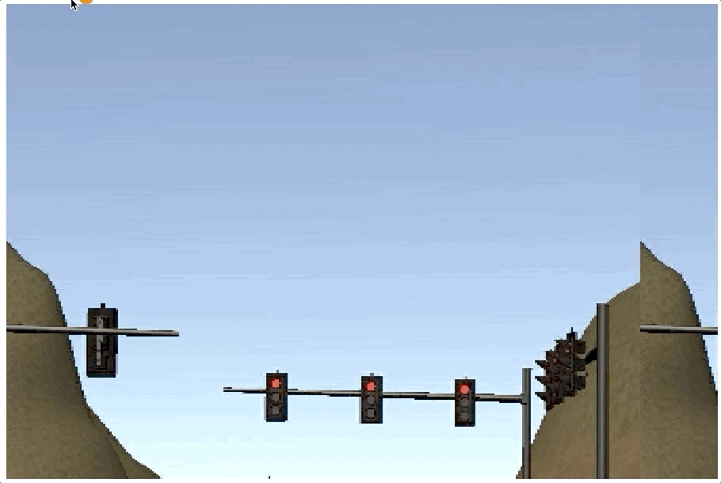

# Train a traffic light classifier using Tensorflow Object Detection API

## Objective
Train an object detection model to detect red traffic light. The frozed graph is then used for inference to control brake/throttle of an autonomous vehicle to stop the car at red traffic light and move under green light.

## Constraints
* The machine used for inference is poor and therefore the computation should be very efficient
* The inference throughput should be 10 images per second at minimum to be used in autonomous vehicle control
* The inference runtime environment is old, based on Tensorflow 1.3

## Strategy
The recent development in computer vision is remarkable and a number of new models have been proposed and the pre-trained models are provided. To take advantage of this,
  a. use transfer learning - i.e. use pre-trained model and fine-tune the model
  b. use newer versions of libraries and then convert the output back to tensorflow v1.3 compatible model

## Instruction
### A. Run on Colab
Everything included in the notebook
* `traffic-light-detection-tf1.ipynb` is for tensorflow v1 (v1.14)
* `traffic-light-detection-tf2.ipynb` is for tensorflow v2 (v2.3)

All you need is run one of these notebooks on Google Colab.
If you clone the repo, change the repo URL to your own.
```
# Repo URL
repo_url = 'https://github.com/yuki678/driving-object-detection'
```

#### Change models and configurations
Add your model to MODELS_CONFIG and select the model.
```
# Models
MODELS_CONFIG = {
    'ssd_mobilenet_v2': {
        'model_name': 'ssd_mobilenet_v2_coco_2018_03_29',
        'model_path': '/models/tf1/my_ssd_mobilenet_v2/',
        'pipeline_file': 'pipeline.config',
        'batch_size': 32
    }
}

# Select a model to use.
selected_model = 'ssd_mobilenet_v2'
```

Also, update pipeline.config.
These websites provide a good reference:
* [Tensorflow model repo](https://github.com/tensorflow/models/tree/master/research/object_detection/samples/configs)
* [Tensorflow Object Detection aPI Tutorial for v1.14](https://tensorflow-object-detection-api-tutorial.readthedocs.io/en/1.14.2/training.html#configuring-a-training-pipeline)
* [Tensorflow Object Detection aPI Tutorial for v2.x](https://tensorflow-object-detection-api-tutorial.readthedocs.io/en/latest/training.html#configure-the-training-pipeline)

Models can be downloaded from Model Zoo. Links in the model repo document are useful
* [tf1_detection_zoo.md](https://github.com/tensorflow/models/blob/master/research/object_detection/g3doc/tf1_detection_zoo.md)
* [tf2_detection_zoo.md](https://github.com/tensorflow/models/blob/master/research/object_detection/g3doc/tf2_detection_zoo.md)

### B. Run locally
This tutorial provides just right amount of information you can follow.
* [Tensorflow Object Detection aPI Tutorial for v1.14](https://tensorflow-object-detection-api-tutorial.readthedocs.io/en/1.14.2/install.html)
* [Tensorflow Object Detection aPI Tutorial for v2.x](https://tensorflow-object-detection-api-tutorial.readthedocs.io/en/latest/install.html)

Here are what I did on Udacity workspace, which is a Ubuntu v16 environment.
What are unique for this environment is, it keeps only files and folders under `/home/workspace/` and all the rest are reset every time you reconnect to the workspace, but this `/home/workspace/` is limited to 3GB and not enough to save all necessary dependencies here.

#### Once time setup
1. Make directory under workspace
```bash
cd /home/workspace
mkdir object_detection && cd "$_"
mkdir workspace
mkdir Tensorflow
export WS_PATH=`pwd`
```

2. Add environment variables to `~/.bashrc` (or, `/home/workspace/.student_bashrc` in udacity workspace)
```bash
export PATH=$PATH:/root/miniconda3/bin:/usr/local/cuda-9.0/bin
export LD_LIBRARY_PATH=/opt/carndcapstone/cuda-8.0/extras/CUPTI/lib64:/opt/carndcapstone/cuda-8.0/lib64:
export CUDA_HOME=/opt/carndcapstone/cuda-8.0
export PYTHONPATH=$PYTHONPATH:$WS_PATH/Tensorflow/models/research/slim
```

3. Install Tensorflow Models
Make sure to have the right version of protoc from https://github.com/protocolbuffers/protobuf/releases.
(e.g. v3.4.0 can be used for tensorflow v1.13.0)

```bash
cd $WS_PATH/Tensorflow
git clone -b r1.13.0 https://github.com/tensorflow/models.git # for specific branch
# git clone https://github.com/tensorflow/models.git # for latest

# compile protocol buffers
cd models/research/
protoc object_detection/protos/*.proto --python_out=.
```

4. Install COCO API
```bash
cd $WS_PATH/Tensorflow
git clone https://github.com/cocodataset/cocoapi.git
cd cocoapi/PythonAPI
make
cp -r pycocotools $WS_PATH/Tensorflow/models/research/
```

5. Clone the repo
```bash
cd $WS_PATH
# Change this to your own repo if any
git clone https://github.com/yuki678/driving-object-detection workspace
mkdir workspace/pre-trained-models
mkdir workspace/exported-models
```

6. Prepare labelled images
Assuming all images are saved under `$HOME_DIR/workspace/images/`
Run `labelImg` and annotate each image - usage: https://github.com/tzutalin/labelImg#usage
This is easier to do on a local environment rather than a workspace in VM.
```bash
cd $WS_PATH/workspace/images
pip install labelImg
labelImg
```

7. Create Label Map if created new labels
Update `annotations/label_map.pbtxt` for the new label definitions in this format
```
item {
    id: 1
    name: 'cat'
}

item {
    id: 2
    name: 'dog'
}
```

8. Partitioning the images into train and test
```bash
cd $WS_PATH/workspace

# This split images under `images` to train:test=9:1 and copy under train/ and test/ folders
python scripts/partition_dataser.py -x -i images/ -r 0.1
```

9. Convert *.xml files to a unified *.csv
```bash
cd $WS_PATH/workspace

# Create train data:
python scripts/xml_to_csv.py -i images/train -o annotations/train_labels.csv

# Create test data:
python scripts/xml_to_csv.py -i images/test -o annotations/test_labels.csv
```

10. Convert *.csv to *.record
Please use `generate_tfrecord_v1.py` for Tensorflow v2.x

```bash
# Create train data:
python scripts/generate_tfrecord_v1.py \
    --csv_input=annotations/train_labels.csv \
    --output_path=annotations/train.record \
    --img_path=images/train \
    --label_map annotations/label_map.pbtxt

# Create test data:
python scripts/generate_tfrecord_v1.py \
    --csv_input=annotations/test_labels.csv \
    --output_path=annotations/test.record \
    --img_path=images/test \
    --label_map annotations/label_map.pbtxt
```
11. Download pre-trained models
Models can be downloaded from Model Zoo. Links in the model repo document are useful
* [tf1_detection_zoo.md](https://github.com/tensorflow/models/blob/master/research/object_detection/g3doc/tf1_detection_zoo.md)
* [tf2_detection_zoo.md](https://github.com/tensorflow/models/blob/master/research/object_detection/g3doc/tf2_detection_zoo.md)

Move the downloaded .tar.gz file to `$WS_PATH/workspace/pre-trained-models`
```
cd $WS_PATH/workspace/pre-trained-models/
tar zxvf [downloaded .tar.gz file] 
```

12. Configure a training pipeline
Edit the config file - please refer to A. Run on Colab
In my case, the following parameters need changed in addition to must items such as paths.
* Learning Rate - initial_learning_rate, decay_step, decay_factor
* Aspect ratio and scale of boxes - anchor_generator
* max_detections_per_class, max_total_detections
* Batch Size - batch_size
* Training Steps - num_steps
* Evaluation Steps (optional)

Now, the directory structure and files under `$WS_PATH/workspace` should look like
```
workspace
├─ annotations
│   ├─ label_map.pbtxt
│   ├─ train.record
│   └─ test.record
├─ images
│   ├─ test
│       ├─ :
│   ├─ train
│       ├─ :
├─ models
│   ├─ my_faster_rcnn_resnet101
│   │   ├─ pipeline.config
│   ├─ :
├─ pre-trained-model
│   ├─ faster_rcnn_resnet101_kitti_2018_01_28
│   ├─ :
└─ scripts
```

#### Running training
13. Execute environment setup script to install all necesary libraries in a conda env
```bash
cd $WS_PATH/workspace
source setup_env.sh
```
Note: This script is for Tensorflow v1.14. For v2.x, please modify the library versions.

14. Run training
For Tensorflow v1.14
```bash
cd $WS_PATH/workspace
python $WS_PATH/Tensorflow/models/research/object_detection/model_main.py \
    --pipeline_config_path=models/[selected model path]/pipeline.config \
    --model_dir=$LOG_PATH \
    --alsologtostderr
```

For Tensorflow v2.3
```bash
cd $WS_PATH/workspace
python $WS_PATH/Tensorflow/models/research/object_detection/model_main_tf2.py \
    --pipeline_config_path=models/[selected model path]/pipeline.config \
    --model_dir=$LOG_PATH \
    --alsologtostderr
```

`model_main_tf2.py` does not run the evaluation while training.
Evaluation model runs separately by adding `checkpoint_dir` option.
```bash
python $WS_PATH/Tensorflow/models/research/object_detection/model_main_tf2.py \
    --pipeline_config_path=models/[selected model path]/pipeline.config \
    --model_dir=$LOG_PATH \
    --checkpoint_dir=$LOG_PATH \
    --eval_timeout=600 # remove this if you want to run infinitely
```

15.  Run Tensorboard (Optional)
To check the progress and evaluation, run the following and access to http://localhost:6006
```bash
tensorboard --logdir=$LOG_PATH
```

16. Export the output
For Tensorflow v1.14, first check the last checkpoint under $LOG_PATH, which is the last created model.ckpt-* (the largest number in *).
Then execute a python script with the checkpoint.
```bash
cd $WS_PATH/workspace
python $WS_PATH/Tensorflow/models/research/object_detection/export_inference_graph.py \
    --input_type=image_tensor \
    --pipeline_config_path=models/[selected model path]/pipeline.config \
    --output_directory=$WS_PATH/workspace/exported-models \
    --trained_checkpoint_prefix=[last_model_path]
```
In Tensorflow v2.x, the last checkpoint can be found implicitly
```bash
python /content/models/research/object_detection/exporter_main_v2.py \
    --input_type image_tensor \
    --pipeline_config_path models/[selected model path]/pipeline.config \
    --trained_checkpoint_dir $LOG_PATH \
    --output_directory $WS_PATH/workspace/exported-models
```

### Converting the exported model for Tensorflow 1.3
As written in the constraint, the runtime environment is Tensorflow 1.3 and the exported model is incompatible with this version, which requires additional steps to convert the frozen inference graph.

All needed are to prepare an environment with Tensorflow 1.4, which has the oldest Object Detection API and compatible with 1.3 , and export the model from the trained model.

#### Prepare Tensorflow 1.4 env
1. Create a conda env
```bash
conda create -n tf1.4 python=3.6
conda activate tf1.4
```

2. Install libraries
```bash
pip install tensorflow==1.4.0
conda install pillow lxml matplotlib
```

3. Clone Tensorflow model repo, checkout a compatinble version
```bash
cd $WS_PATH/workspace
mkdir export_model && cd "$_"
git clone https://github.com/tensorflow/models.git
cd models
git checkout d135ed9c04bc9c60ea58f493559e60bc7673beb7
```

4. Copy required files
```bash
mkdir exporter
cp -r models/research/object_detection exporter/object_detection
cp -r models/research/slim exporter/slim
rm -rf models
cd exporter
```

5. Download protoc v3.4.0 and copy protoc to exporter/
```bash
Download from here and unarchive:
https://github.com/protocolbuffers/protobuf/releases/tag/v3.4.0

cp [dowload foler]/protoc-3.4.0-*/bin/protoc .
rm [dowload foler]/protoc-3.4.0-*
```

6. Compile protocol buffers
```bash
protoc object_detection/protos/*.proto --python_out=.
```

7. Set PYTHONPATH. This needs to be done everytime opening a shell. Can be configured in .bashrc or conda activate/deactivate scripts.
```bash
export PYTHONPATH=$PYTHONPATH:`pwd`:`pwd`/slim
```
If you miss this step, you would probably get "object_detection" module not found error.

8. Run test
```bash
python object_detection/builders/model_builder_test.py
```

9. Create a directory to store the converted model
```bash
mkdir converted
```

#### Export the model
Export from the last checkpoint
e.g.
```bash
python exporter/object_detection/export_inference_graph.py --input_type=image_tensor --pipeline_config_path=tf1_ssd_mobilenet_v2/pipeline.config  --trained_checkpoint_prefix=tf1_ssd_mobilenet_v2/model.ckpt --output_directory=converted
```
Please change the pipeline config and checkpoint path. Also, set PYTHONPATH when running in a new shell.

### Optimize the model (Optional)
The frozen model complexity can be reduced to gain further efficiency for inference.
In fact, I have tried this but the inference speed didn't improve at all... nevertheless, here is how.

1. First, download tensorflow if you haven't
```bash
cd $WS_PATH/Tensorflow
git clone https://github.com/tensorflow/tensorflow.git
```

2. To use bazel compilation, install bazel if not yet done.
```bash
# Install bazel via brew
brew tap bazelbuild/tap
brew install bazelbuild/tap/bazel
# Execute the command shown at the end of console output
cd "/usr/local/Cellar/bazel/3.5.0/libexec/bin" && curl -fLO https://releases.bazel.build/3.1.0/release/bazel-3.1.0-darwin-x86_64 && chmod +x bazel-3.1.0-darwin-x86_64

```

3. Bazel build - takes a while
```bash
# 
cd $WS_PATH/workspace/exported-models/
mkdir optimizer && cd "$_"
bazel build $WS_PATH/Tensorflow/tensorflow/tools/graph_transforms:transform_graph
bazel build $WS_PATH/Tensorflow/tensorflow/tools/graph_transforms:summarize_graph
```

4. Apply the optimization
```bash
bazel-bin/tensorflow/tools/graph_transforms/transform_graph \
    --in_graph=../converted/frozen_inference_graph.pb \
    --out_graph=../converted/optimzed_inference_graph.pb \
    --inputs='image_tensor' \
    --outputs='detection_boxes,detection_scores,detection_classes,num_detections' \
    --transforms='
        strip_unused_nodes()
        remove_nodes(op=Identity, op=CheckNumerics)
        fold_constants(ignore_errors=true)
        fold_batch_norms
        fold_old_batch_norms'
```
To shrink the file size, `round_weights(num_steps=256) ` can be added at the end of transforms option.
To quantize and store values in eight bit, `quantize_weights` can be added.

5. Check the model summary
```bash
# Model before the optimization
bazel-bin/tensorflow/tools/graph_transforms/summarize_graph --in_graph=../converted/frozen_inference_graph.pb

# Model after the optimization
bazel-bin/tensorflow/tools/graph_transforms/summarize_graph --in_graph=../converted/optimzed_inference_graph.pb
